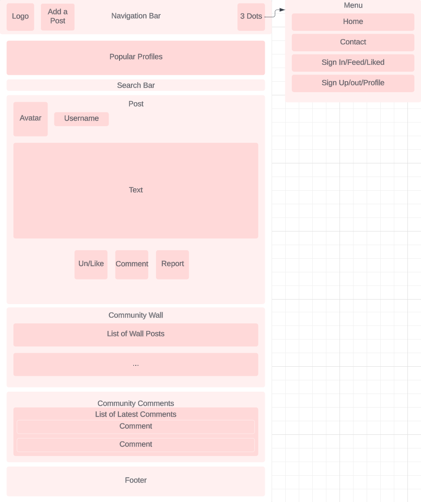
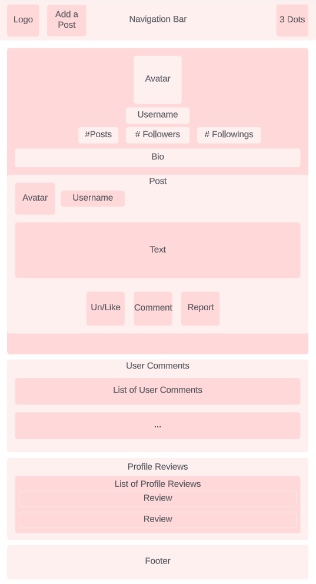
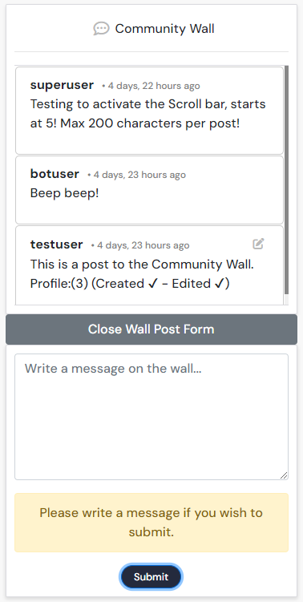
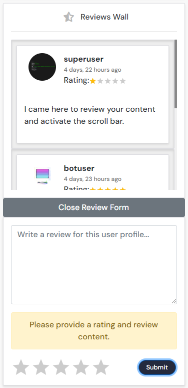
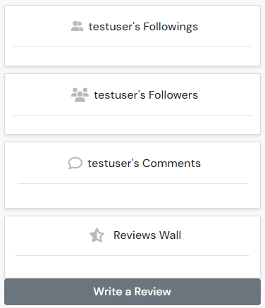
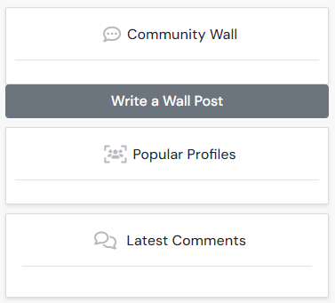
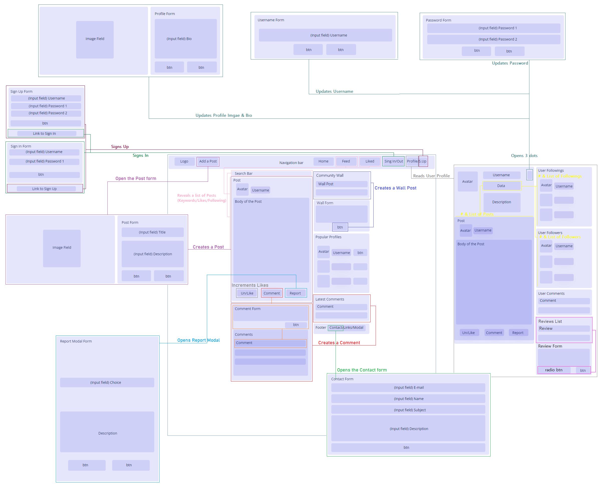

# Connect
Connect is a generic Social media platform that allows users to create Posts, write Comments, Un/Like Posts, Un/Follow Users, write Wall messages and leave Reviews on a user Profile. Very much similar to Instagram and X, the app was designed to allow Users to share photos with a title & description, within the community.

It is a website where Users can share their pictures, give feedback to others & connect.


## Live Project
- The live website can be found [here](https://connect-network-ee92c70de293.herokuapp.com/)

## Purpose of the website:
- To provide a platform where users can share their posts/pictures and comments.
- To create a community of users and like minded individuals.
- To connect with people.

## Set Goals
- To create a fully functional social media app
- To allow user accessibility, interaction & control over their data
- To create a Community and build content on the platform (imagery)

## Design:
The website was designed with the intent to allow users to browse posts, read comments and navigate throughout the website at ease.
It allows users to access all components easily, and lets users perform all CRUD functionalities for their, Posts, Comments, Likes & Profiles, to CRU Reviews and Wall messages. Furthermore, users can C Reports for posts & C messages using the Contact for the moderation panel.

# Wireframes
## Desktop

- Read a Post on /home /feed /liked


- Create & Update a Post


- Create a Report


- Creat a Contact


- Read a Profile


- Sign Up


- Sign In


- Update the Profile


- Update the Username


- Update the Password


- Delete the Profile


# Mobile
For mobiles, the structure of the website remained the same with the exception of the Posts and Profile pages, where the horizontal components adopted a vertical fashion.

- Read a Post on /home /feed /liked



- Read Profile 



## Colour palette
It relied heavily on colors that should be appealing to the user, especially for those who might visit the website on a daily basis.
For such, it makes use of a colour palette of a mere white & gray blend for the navigation bar and Orange, close to Vermillion, for the Logo, buttons and active Links. The background is best defined by a grayish white and the body of the post white, bordered by solid lines.


The components such as NavBar, Posts, Comments, Walls, Reviews, Users list and Footer are stylized by a shadow-box to invoke the sense of a Polaroid film/picture.

## Fonts
The fonts used for this website were "DM sans" and "sans serif" by default. A choice that should be plain and easy to read. The fonts for the navigation links and logo on the navigation bar are dyed in orange, while the body for the posts present themselves with dark grayish/black tone that doesn't stand too much from the body. Links in the navigation bar are gray, but when highlighted or hovered turn orange. If a tab is active, a darker orange highlights the icons of the tab a user is on. Links change color upon hover, particularly the username/owner of a post, the icons on a post, such as heart(likes), dialogue(comments), flag(reports), the social media links. The links that redirect users to other pages in the Footer and icons on each conponent enjoy the same orderliness.


# Components, Functionality & Reusability:
This project includes several functional and reusable React components that are used for different parts of the application. Below are the key components:

# Navbar, Header & Favicon
The Navbar located at the upper end of the page, serves as the menu for the user to navigate between pages. From left to right is the "Logo", followed by "Add post" (if the user is authenticated), then "Home", "Feed", "Liked", "Sign In" (if not authenticated) "Sign Out" and "Profile".
The user can then access these components by clicking the desired icon. A hover effect is in place and the cursor turns into a pointer to advert users of its accessibility.


# Posts
Users can then create Posts (if authenticated) by navigating to "Add post" next to the logo. From there, users will be prompt to upload an image and write the title and a brief description of the post. Once users click the Create/Submit button, the post will be displayed at "/" or "Home", for the whole community to see. Posts can also be Edited or Deleted by the author of the post, if desired, by navigating inside the Post and clicking the little dropdown menu defined by a Pencil or Bin icons, accordingly.
Posts may also be Liked/Disliked, Commented and Reported. This functionality allows the community to stay active and the users engaged.

- ## Post.js
- Component used for rendering individual posts. It displays post details such as owner, profile image, title, content, and associated functionalities.
- Allows users to navigate to the post details page by clicking on the post image or title.
- Handles like, unlike, edit, and delete actions based on user permissions.
- Shows the number of likes, comments and allows users to make use of the report button for flagging a post.

- ## PostCreateForm.js
- Component used for creating new posts with title, description, and image upload.

- ## PostEditForm.js
- Component used for editing existing posts with title, description, and image upload.
- Alows users to modify their post details.

- ## PostPage.js
- Component used for displaying a single post along with its comments.
- Fetches and presents detailed information about the post and associated comments.
- Allows authenticated users to create comments, displays existing comments, and supports infinite scrolling.

- ## PostsPage.js
- Component responsible for displaying a list of posts, including infinite scrolling for additional posts.
- Allows users to search for posts based on a provided query.
- Provides a layout for the search bar, popular profiles, and community comments. It also Includes a wall section for wall posts, allowing users to create new wall posts.


# Likes
From a Post, Users (if authenticated) can also leave likes and consequently remove the like (dislike) to Posts. This shows appreciation from users to the community.
The counter for Likes then rises per user, by +1 or -1, but never below 0.
Owners of a Post cannot like/dislike their own posts.


# Report
Users (if authenticated) also have the ability to Report Posts. From a Post click on the Flag icon. From there a modal is displayed with a Reason of choice and an optional description field. This supports the Administration panel to moderate and fight Spam &/or Innapropriate content.

- ## Report.js
- Component used to report a post by providing a reason and an optional description. It opens a modal for the reporting process and submits the report to the backend.
- To use this component, one must import it and pass the `postId` prop. Users can report posts by clicking the flag icon, which opens a modal to submit reports.

- ## ReportModal.js
- Sub-component used by the Report component to create the reporting modal. It provides a user interface for selecting a reason, entering a description, and submitting the report.
- Used internally by the Report component and does not need to be imported separately. It creates the modal interface for reporting a post by a user.


# Comments
Users (if authenticated) can write Comments on Posts. This functionality encourages users to give feedback on posts. Comments, like Posts, can also be Edited or Deleted, by following the same pattern in Posts.
From the Post page, users ought to click on the Dialogue icon to access the list of Comments. From there a comment can be written via the input form, from the Comment section and hit submit. If no characters have been written and the submit button pushed, a warning message will be displayed.
If successfully submitted, a confirmation message is shown, while the form goes hidden, preventing users from spamming.

- ## Comment.js
- Component used for rendering individual comments within the app.
- Provides functionality for displaying, editing, and deleting comments and make use of the MoreDropdown component for additional actions (Editing and Deleting).
- To use this component, one must import it and pass it in the rendering of comments within the app.

- ## CommentCreateForm.js
- Component used for creating new comments within the app. It Renders a form with a textarea for users to input their comments.
- axiosRes API for is used for making requests to the backend.
- Provides visual feedback to users with alerts for successful comment creation or warnings for empty submissions.
- To use this component, one mst import it and include it in the rendering of comment creation forms within the app.

- ## CommentEditForm.js
- Component used for editing existing comments within the app.
- Renders a form with a textarea for users to modify their comments and give the possibility for users to Update the comment or Cancel the edit.
- To use this component, one must import it and include it in the rendering of comment edit forms within the app.


# Footer
Located on the right panel, just below the "Latest/Users Comments" component (Home/Profile), or SignIn/Up (Components), the footer contains access to the "Contact" component, the social media links & the modal to the "Terms of Service". It is best defined by icons easily recognizable and navigable by Users.

- ## Footer.js
- Component used for rendering the footer section of the web app.
- Provides contact information and links to social media and the Terms of Service. It also contains a modal for the "Terms of Service."
- To use this component, import it and include it in your app's layout to display the footer.


# Wall
Presented at "/" or "Home", the Wall component is the first component rendered on the right side of the page. It allows users to create/update messages accordingly, so the community can voice their input or simply introduce themselves. Similar to a chat room, Users are encouraged to use that component as chitchat.
From the Home page, users ought to open the Wall form and write a message in the form and then click the submit button. Else a warning message is displayed informing users to try again.
If successfully submitted, a confirmation message is shown, while the form and submit buttons go hidden, preventing users from spamming.

- ## WallPost.js
- Component used for displaying and managing wall posts. It provides functionality for viewing and editing wall posts.
- To use this component, one must import and pass the necessary props. It includes features for editing and saving wall posts.

- ## WallPostCreateForm.js
- Component used for creating new wall posts. It includes a form for users to write and submit wall posts.
- To use this component, one must import and apss the required props, such as `profileId`, `createWallPost`, and `currentUser`. Users can write wall posts, and the component handles form submission and error handling.

- ## WallPostsList.js
- Component used to display a list of wall posts. It fetches wall posts from an API and continuously updates them every 1sec.
- To use this component, one must import and pass the `profileId` and `currentUser` props. It renders a list of wall posts and provides a collapsible interface for viewing them.




# Contact
The "Contact" component grants users the possibility to contact the administration panel regarding any issues they are having with the platform. Users (authentication not necessary) need to input a valid e-mail*, a username, subject of concern and the message they wish to send to the Support team. Upon a successful submission, Users are notified a message has been sent.

- ## ContactCreateForm.js
- Component used for creating and submitting contact forms. It uses the `react-hook-form` library for form handling and sends data to a remote API upon submission.
- To use this component, one must import it and pass the component in the app. It provides a form for users to submit their contact information and messages. After submission, it displays a success message or error message as appropriate.

- ## ContactSuccessForm.js
- Component used to displayed when a contact form is successfully submitted. It provides a success message to the user.
- To use this component import it and pass the component in the app to display a costumized success message after a user successful submission to a contact form.


# Terms of Service
When clicking the Terms Of Service link, located at the Footer, Users should be able to read the the "~~legal agreements~~" between Connect and a person who wants to use that service. This is defined by a modal that pops up and only goes away when the terms are met by clicking the button at the end.

- ## TermsOfService.js
- Component used for displaying the Terms of Service. It opens a modal that provides users with the terms and conditions for using the Connect app.
- To use this component, one must import it and pass the isOpen (to control modal visibility) and onRequestClose (to handle modal closing) props.


# Signin
After creating an account, Users may log in onto their users accounts, through the Sign In component. Users will then have the possibility perform CRUD functionalities in the platform and interact with the community. To sign in Users are requested to input their log in credentials, such as Username and Password, previously created in the Sign Up page.
The Sign in page is best defined by a a Sign in form and an image. (Ideally the image should be dynamic and change its theme according to the season (unapplied), for the time being summer)


# Signup
To be part of this community, Users must create an account. For such, users must input a Username, Password & Password confirmation and hit Sign Up. Upon a successful account creation, users can then log in via Sign In.
The Sign up page is best defined by a a Sign Up form and an image. (Ideally the image should be dynamic and change its theme according to the season (unapplied), for the time being summer)


# Profile
Once a User account is created and a user is authenticated, one can access a User "Profile".
The User Profile details all activity performed by a given user, such a latest Posts & Comments and the number & List of Followers and Followings. Owners of a profile and visitors can then easily track the latest motions and be on pair with their followings.

- ## Profile.js
- Component used to display user profiles with optional buttons for follow/unfollow actions.
- Uses `useCurrentUser` and `useSetProfileData` from context to access current user data and manage profile actions.
- Handles conditional rendering of follow/unfollow buttons based on ownership and relationship status.
- To use this component, one must import Profile and pass `profile` data.

- ## ProfilePage.js
- Component used to display the user profile page. Depends on custom components like Asset, Post, ProfileEditDropdown, FollowingProfiles, FollowedProfiles, FilteredComments, ProfileReviews, ReviewCreateForm, and Footer.
- Makes use of InfiniteScroll to load more posts, under `asLoaded` and keep track if the profile data has loaded. 
- Makes use of `useEffect` to fetch profiles and posts and renders the Follow/unfollow buttons based on the relationship between the current user and the profile owner.
- To use this component, one must import the ProfilePage component and render it within the app to display a user's profile page.


# Edit Profile, Change Username, Update Password, Delete Profile
As the owner of a Profile (if authenticated), one may Edit the user handle, avatar, password or entirely delete the Profile. This allows the user to have total control of the User profile and CRUD at will. For such, each functionality is accessed from the dropdown menu, from within a profile owned by a user.

- ## ProfileEditForm.js
- Component used for Updating the User profile.
- Uses axiosReq for API requests and depends on context hooks from `CurrentUserContext` for managing user data.
- The state `profileData` holds data for the name, content, and image.
- To use this component, one must import and render ProfileEditForm in the app for allowing users to edit their profile.


- ## UsernameForm.js
- Component used for changing a user's username.
- Utilizes `useCurrentUser` and `useSetCurrentUser` context hooks for user-related actions.


- ## UserPasswordForm.js
- Component used for updating a userser password, requiring external props but the `useCurrentUser` context hook for user-related actions.
- To use this component, one must import it into a user profile page. Integrate it within the parent component with the necessary context providers, allowing users to update their passwords.


- ## ProfileDeleteForm.js (BUGGED)
- Component used for eliminating user profile accounts.
- Upon confirmation, the component should triggers an asynchronous request to delete the user's profile. The handleDelete function, responsible for this deletion process should have ensured that the user is appropriately logged out by removing the access token and updating the current user context.
- BUGGED: Please, read the TESTING.md linked at the end of this README.md


This component integrates seamlessly into a user settings or profile page, offering a clear and user-friendly way for individuals to manage their account preferences. It adheres to a clean and minimalist design, following the application's visual style defined by the appStyles and buttonStyles. Importing this component into the desired location within the React application allows users to interact with the deletion functionality effortlessly.


# Reviews
Displayed in a user Profile, the Review component can be found at the lower right side of the profile page of a user. It allows users to create/update reviews accordingly, so the community can rate themselves and their content. It makes use of the react-simple-star-rating when classifying a user.
From a user Profile page, users ought to write a review and select the number of stars in the form. If the form is not populated a warning message is displayed informing users on how to proceed.
If successfully submitted, a confirmation message is shown, while the form and submit buttons go hidden, preventing users from spamming.

- ## ProfileReviews.js
- Cmponent used for displaying and managing user reviews. It fetches and displays reviews for a given user profile.
- To use this component, one must import and pass the `profileId` and `currentUser` props. It automatically fetches and updates reviews for the specified user profile.

- ## Review.js
- Component used for displaying individual reviews. It includes options for editing and updating reviews.
- To use this coponent one must import and pass the necessary props `owner`, `updated_at`, `content`, `rating`, and `currentUser`. It allows users to edit their reviews and displays review information.

- ## ReviewCreateForm.js
- Component used for creating reviews. It makes use of a form for users to rate and write reviews upon.
- To use this component one must pass the `profile_id`, `createReview`, and `currentUser` props. It allows users to submit reviews and handles form validation and submission.

- ## ReviewUpdateForm.js
- Component used for updating existing reviews. It provides options for changing the rating and content of a review.
- To use this component one must pass the necessary props, such as `reviewId`, `content`, `rating`, and `onSave` (a callback function to handle the updated content). Users can update their reviews.



# Follow
As a User (if authenticated), one can follow/unfollow other users. This functionality allows users to stay updated with the posts of their Followings. When following another user profile, the feed of all followings can be accessed via the "Feed" tab and will display the posts chronologically. To Follow a user one may do it through a user profile or from the PopularProfiles component. Thus, the number for each functionality will be incremented accordinglly in the Profile page.

# Popular Profiles
The PopularProfiles component located at "/" (/home), (/feed), (/liked) displays the 10 most active Profiles. This component lets the whole community access and follow these particular users. It further promotes less popular Profiles to be more active in order to climb the ladder and be connected by other users.

- ## PopularProfiles.js
- Component used for displaying popular profiles.
- Maksw use of useProfileData to access popular profiles data from the profile context.
- To use this component, one must import PopularProfiles.


# Followers & Following
The Followers and Followings component located only on the users Profile page displays a list, truncated by 5 users, of all the users that a user is either following or being followed by.

- ## FollowedProfiles.js
- Component used for displaying a list of profiles that follow a specific user.
- Fetches profiles following the specified user from the API.
- To use this component, one must import FollowedProfiles and pass `followedId` as props.

- ## FollowingProfiles.js
- Component used to render profiles followed by a user.
- Uses fetchProfileDetails to get details for each followed profile.
- To use this component, one must import FollowingProfiles and pass `ownerId` as props.


# Filtered Comments by User & Community Comments
Respectively, the Filtered Comments & Community Comments components render in the Profile page and "/" accordingly.
Filtered Comments lists all comments & details submited by a user to a list of posts from latest to oldest. Ergo, for each comment a link is attributted to the post of a comment, if a user wishes to read the parent Post.

- ## SnipetComments.js
- Component used to display user comments within a snippet format.
- Properties to load include profile_id, profile_image, owner, updated_at, content, and post.
- To use this component, import it and pass the required props to display user comments within a snippet format.

- ## CommunityComments.js
- Component used to display the latest comments from the community. It fetches comments from an API and displays them in a chat-like format.
- To use this component, import it, and it will automatically fetch and display the latest comments from the community.

- ## FilteredComments.js
- Component used to display filtered comments based on a specific profileId. It fetches comments from an API and filters them by profileId.
- To use this component, one must import import it and pass the profileId prop. It will automatically fetch and display comments related to the specified profile.


- Community Comments lists all comments & details submited by all users to a list of all posts from latest to oldest. Ergo, for each comment a link is also attributted to the post of a comment, if a user also wishes to read the parent Post.


- Due to the vast volume of components and possible distractions that may cause a user to be confused... to keep the space organized and clean, users can toggle on and off the content for its components visibility, when clicking its respective icon/title.





# Features & Functionality
## Features and Functionality for Reg. Non-Registered Users:
- Visitors can read all posts from "/".
- Visitors can read all users' posts from /profiles/(id)/.
- Visitors can create a user account through /signup/.
- Visitors can navigate to the "/", "/signin", "/signup", "/profiles/(id)", "/contact" pages.
- Visitors can access external links on users posts/comments and in the Footer.
- Visitors can send messages to the admin panel via the contact form, from /contact/

## Registered Users (CRUD) can do the above as a Visitor, moreover:
- Users can sign in/out through the "/signin" & "/signout" available on the NavBar.
- Users can create posts through the "posts/create" component available on the NavBar.
- Users can update their posts through the "/posts/(id)/edit" functionality available in the MoreDropdown menu, inside the Post.
- Users can delete their posts through the "Delete" functionality provided in the MoreDropdown menu, inside the Post.
- Users can Like/Dislike all posts through the "Like/Dislike" functionality under the Post. (Users cannot use this fuctionality for their own Posts)
- Users can navigate to their own Profile.
- Users can update their own Profile Bio & Profile Picture in "Edit Profile" (/profiles/(id)/edit), from the Dropdown menu.
- Users can update their Username in "Change Username" (/profiles/(id)/edit/username), from the Dropdown menu.
- Users can update their Password in "Update Password" (/profiles/5/edit/password), from the Dropdown menu.
- Users can update delete their own Profile accounts by clicking "Delete Account", from the Dropdown menu. (Bugged).
- Users can create Reports via a modal associated to a post.
- Users can create Wall posts via the Wall component at "/".
- Users can update their Wall posts via their posts on the Wall.
- Users can create Reviews on each other profiles, (/profiles/(id)/).
- Users can update their Reviews from their reviews associated to a profile, via a profile page.



## Planning & Agile

This [project](https://github.com/users/TiagoMA90/projects/9) was planned using Agile methodology and MoSCoW prioritization.

For this purpose, the project was illustrated by [9 initial Milestone](https://github.com/TiagoMA90/connect/milestones?state=closed) entitled "Navigation & Authentication", "Profiles", "Posts", "Likes", "Comments", "Walls", "Reviews", "Contacts" and "Reports" providing the developer with the freedom to accomplish all issues/tasks flexibly before dates deadline set to November. The Milestones were broken according to their components name.

Throughout the development process, tasks started from "Todo," progressing to "In Progress," and finally "Done". The issues were assigned to the sole developer and labeled as "could-have," "should-have,", "must-have", "wont-have" and "bugged".


In order of priority, with 47 User Stories, the Project has:

## must-have
- Edit profile
- Profile page
- Create a comment
- Post page
- View a post
- Create posts
- Conditional rendering
- Refreshing access tokens
- Logged Status
- Sign in
- Authentication - Sign up
- Routing
- Navigation
- Create a Wall post
- View community Wall
- View profile Reviews
- Create profile Review

## should-have
- Footer
- Report a post 
- Feedback via Contact
- Navigate to Contact us
- Update user credentials
- View all posts by a specific user
- View comments 
- Edit post 
- Search for posts
- View latest posts
- Like a post
- Avatar
- Update a Wall post
- Update a profile Review

## could-have
- Pop the modal for the Terms of Service 
- Render followings profiles to a profile
- Render followed profiles to a profile
- Read filtered comments by user
- Read community comments could-have
- Follow/Unfollow a user profile 
- User profile - user stats could-have
- Most followed profiles could-have
- Edit a comment could-have
- Delete comments could-have
- Comment date could-have
- Infinite scroll could-have
- View posts of followed users could-have
- View liked posts could-have
- Delete Profile*(bugged)

## wont-have // bugged
- Delete Profile bugged*(bugged) * Read TESTING.md at the end of this REASME.md *

## Development & Deployment
- From the begining of development, the project started out and continued from the tutorial provided by Code Institute "Moments" unit on the "Advanced Front-end specialization" module.

The project was developed using GitHub and GitPod platforms...
- Navigate to: "Repositories" and create "New".
- Mark the following fields: ✓ Public ✓ Add a README file.
- Select template: "Code-Institute-Org/python-essentials-template".
- Add a Repository name: "digital-nomads".
- ...and create Repository.

... and suffered various executions using the inbuild Terminal.

For Commits on this project, the following commands ran:
- ```git add .``` <- Stages before commiting.
- ```git commit -m "written imperative declaration"``` <- Declares changes and updates.
- ```git push``` <- Push all updates to the GitHub Repository.

Through development the following commands ran:
- ```npm install``` <- Installs Reacts dependencies
- ```npm run start``` <- Runs the app in local environment

Additionally, the following:
- ```npm install react```
- ```npm install axios```
- ```npm install react-bootstrap```
- ```npm install react-router-dom```
- ```npm install react-modal```
- ```npm install react-simple-star-rating```

The database is being hosted on ElephantSQL:
- Create an account(with GitHub) and select TinyTurtle plan.
- From Details collect the URL and paste it on Heroku Config Var.

The static files are being hosted on Cloudinary:
- Create and account (with GitHub)
- From the dashboard collect the API Environment variable and paste it on Heroku Config VAR.

...and hosted on Heroku:
- After creating an Heroku Free account, and applying for Student Pack
- Navigate to: "Create new app" add a unique name "connect-network" and select "Europe" region. Click "Create App"
- Head over to "Settings" tab and apply the respective config VARs
- Move to "Deploy" section and select "Github" method"
- From here search for the repository name "connect", from the GitHub account.
- Hit "Connect" and "Enable Automatic Deploys" to keep the the repository in parallel to Heroku.
- Manually "Deploy Main Branch".
- Upon successful deployment, retrieve the link for the mock terminal.
- The live app can be found [here](https://connect-network-ee92c70de293.herokuapp.com/).

## Languages & Frameworks (Front-end)
- HTML (markup language)
- CSS (style sheet language)
- Bootsrap (CSS framework)
- React Boostrap (CSS framework on React components)
- React (javaScript Library)

## Languages & Frameworks (Back-end)
- DjangoRESTFramework (python framework)

## Other forms of development
- [Google Fonts](https://fonts.google.com/) - Source of fonts
- [FontAwesome](https://fontawesome.com/) - Source of icons
- [Bytes.dev](https://bytes.dev/) - Testing screen sizes
- Chrome DevTools - Testing tool
- [WAVE Evaluation tool](https://wave.webaim.org/) - Testing tool
- [W3jigsaw](https://jigsaw.w3.org/css-validator/) - CSS validation tool
- [JSHint](https://jshint.com/) - Javascript testing tool
- [Diagrams](https://app.diagrams.net/) - Diagram set up
- [Github](https://github.com/) - Host for the repository
- [Gitpod](https://gitpod.io/workspaces) - Code editor
- [ElephantSQL](https://www.elephantsql.com/) - Database
- [Cloudinary](https://cloudinary.com/) - Static & Media host
- [Heroku](https://id.heroku.com/login) - Cloud platform/Host the live project

## Credits
The following sources and references were resorted for the creation of this website:

- The lessons and tutorials provided by Code Institute, on the final module entitled "Moments" for the 'Advanced Front-End' specialization
- The Tutor team provided by Code Institutes Student Support
- The mentor Gareth McGirr for [react-simple-star-rating](https://react-simple-star-rating.vercel.app/?path=/story/introduction--page) and his examplar repo [body-doodles](https://github.com/Gareth-McGirr/body-doodles/tree/main).
- Slack(#project-portfolio-5-advanced-frontend) as a solution platform for broken code and guidance on how to procceed to blockades
- [React](https://legacy.reactjs.org/docs/getting-started.html) documentation
- [React Bootstrap](https://react-bootstrap.netlify.app/) documetation
- Freepiks artwork on [Flaticon](https://www.flaticon.com/authors/freepik) for the logo and additional images

## Testing
- For Manual testing, please refer to [TESTING.md](https://github.com/TiagoMA90/connect/blob/main/TESTING.md)