# Connect
Connect is a generic Social media platform that allows users to create Posts, write Comments, leave Likes & Follow other Users. Very much similar to Instagram and X, the app was designed to allow Users to share photos with a title & description, within the community.

It is a website where Users can share their vacation pictures, give feedback to others & connect.

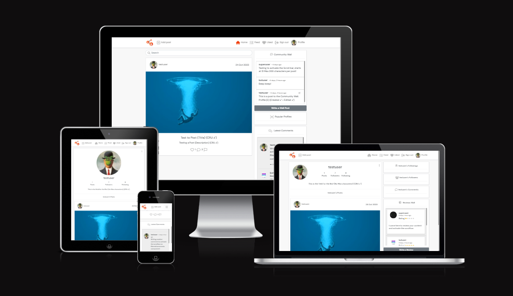

## Live Project
- The live website can be found [here](https://connect-network-ee92c70de293.herokuapp.com/)

## Purpose of the website:
- To provide a platform where users can share their pictures and comments.
- To create a community of users and like minded individuals.
- To connect with people.

## Design:
The website was designed with the intent to allow users to browse posts, read comments and navigate throughout the website at ease.
It allows users to access all components easily, and lets users perform all CRUD functionalities for their, Posts, Comments, Likes & Profiles. Furthermore, users can Report posts & Contact the moderation panel.

## Wireframes 
- Read a Post on /home /feed /liked

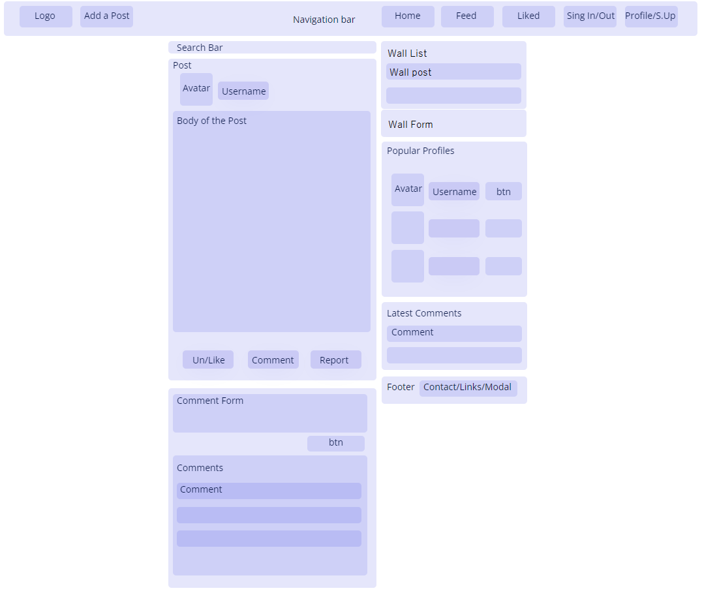

- Create & Update a Post

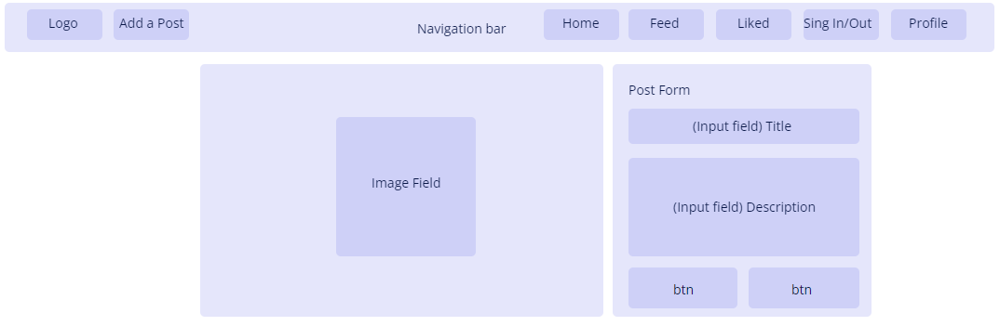

- Create a Report

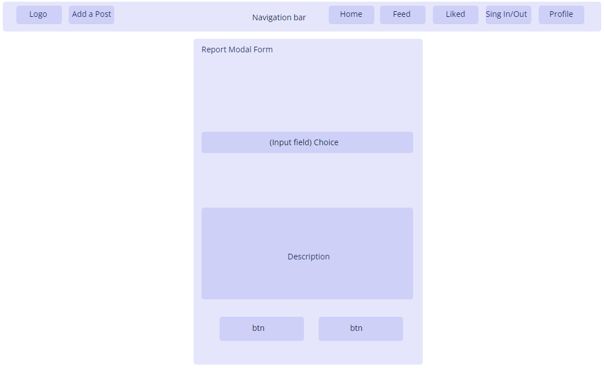

- Creat a Contact

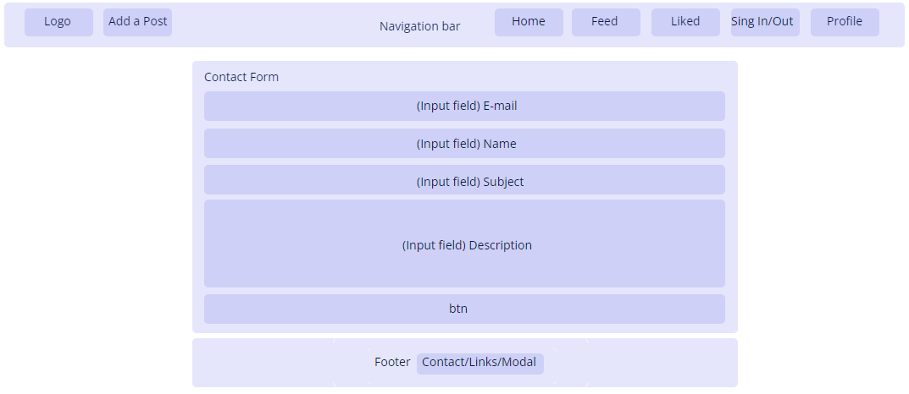

- Read a Profile

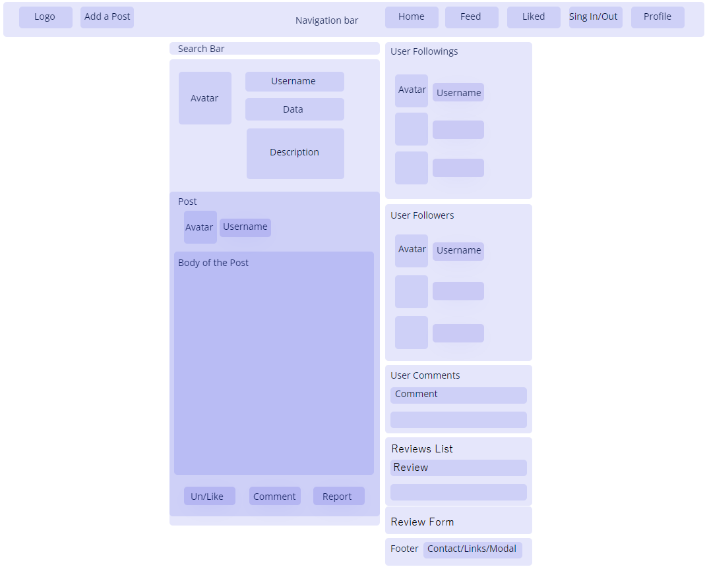

- Sign Up

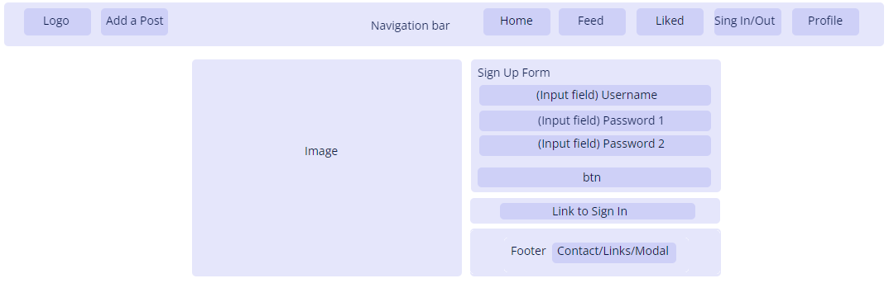

- Sign In

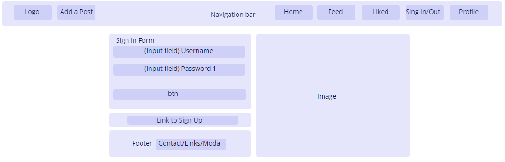

- Update the Profile

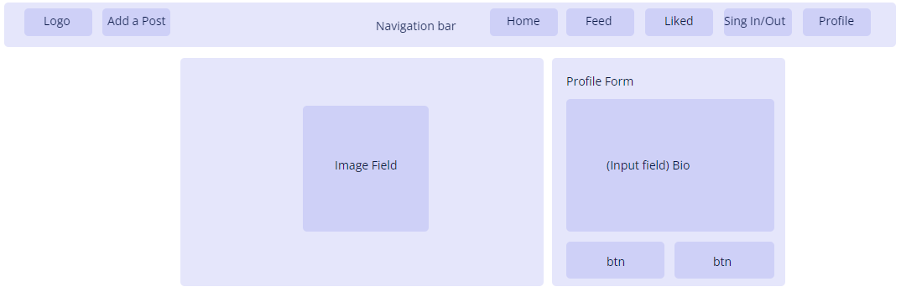

- Update the Username

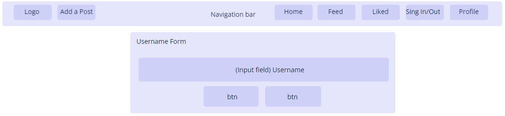

- Update the Password

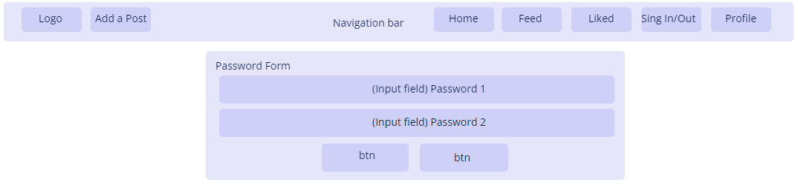

- Delete the Profile

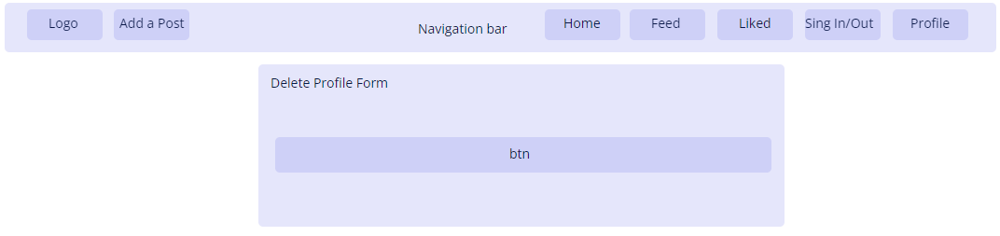

## Colour palette
It relied heavily on colors that should be appealing to the user, especially for those who might visit the website on a daily basis.
For such, it makes use of a colour palette of a mere white & gray blend for the navigation bar and Orange, close to Vermillion, for the Logo, buttons and active Links. The background was best defined by a grayish white and the body of the post white, bordered by solid lines. Blue and Dark tinted blue was also used on a couple of occasions, such as usernames for comments and button for the follow/unfollow on PopularProfiles.

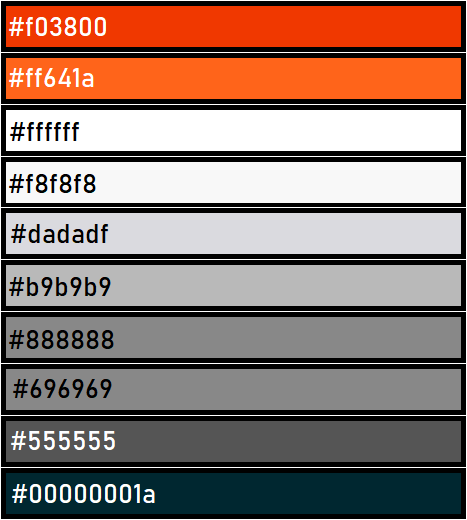

The components such as NavBar, Posts, Comments, the Users list and Footer are stylized by a shadow-box to invoke the sense of a Polaroid film/picture.

## Fonts
The fonts used for this website were "DM sans" and "sans serif" as default. A choice that should be plain and easy to read. The fonts for the navigation links and logo on the navigation bar are dyed in orange, while the body for the posts present themselves with dark grayish/black tone that doesn't stand too much from the body. Links in the navigation bar are gray, but when highlighted or hovered turn orange. If a tab is active, a darker orange highlights the icons of the tab. Links change color upon hover, particularly the username/owner of a post, the icons on a post, such as heart(likes), dialogue(comments), flag(reports), the social media links. The links that redirect users to other pages in the Footer also enjoy the same orderliness.

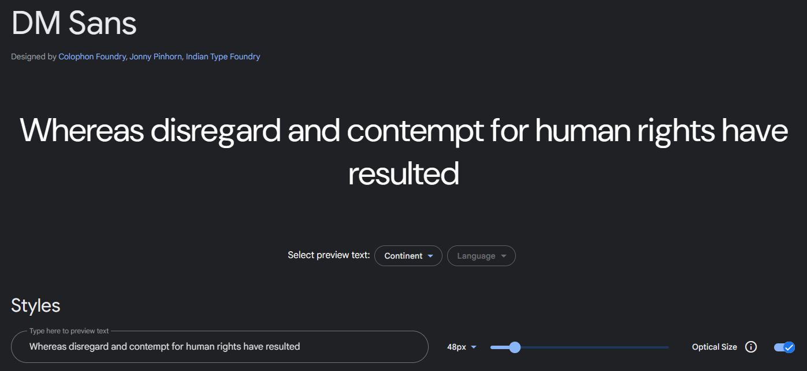

# Components & Functionality:
## Navbar, Header & Favicon
- The Navbar located at the upper end of the page, serves as the menu for the user to navigate between pages. From left to right is the "Logo", followed by "Add post" (if the user is authenticated), then "Home", "Feed", "Liked", "Sign In" (if not authenticated) "Sign Out" and "Profile".
- The user can then access these components by clicking the desired icon. A hover effect is in place and the cursor turns into a pointer to advert users of its accessibility.

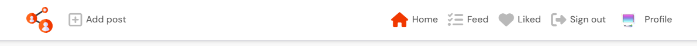

## Posts
- Users can then create Posts (if authenticated) by navigating to "Add post" next to the logo. From there, users will be prompt to upload an image and write the title and a brief description of the post. Once users click the Create/Submit button, the post will be displayed at "/" or "Home", for the whole community to see. Posts can also be Edited or Deleted by the author of the post, if desired, by navigating inside the Post and clicking the little dropdown menu defined by a Pencil or Bin icons, accordingly.
- Posts may also be Liked/Disliked, Commented and Reported. This functionality allows the community to stay active and the users engaged.

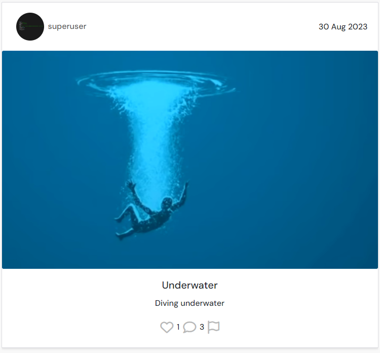

## Likes
- From a Post, Users (if authenticated) can also leave likes and consequently remove the like (dislike) to Posts. This show appreciation from the community.
- The counter then rises per user, by +1 or -1, but never below 0.
- Owners of a Post cannot like/dislike their own posts.

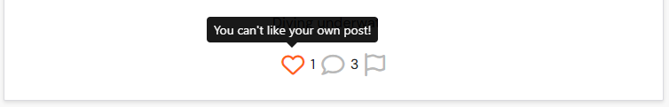

## Report
- Users (if authenticated) also have the ability to Report Posts. From a Post click on the Flag icon. From there a modal is displayed with a Reason of choice and an optional description field.
- This supports the Administration panel to moderate and fight Spam &/or Innapropriate content.

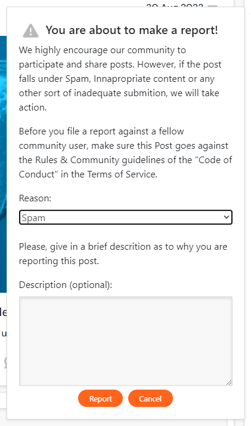

## Comments
- Users (if authenticated) can write Comments on Posts. This functionality encourages users to give feedback on posts. Comments, like Posts, can also be Edited or Deleted, by following the same pattern in Posts.
- From the Post page, users ought to click on the Dialogue icon to access the list of Comment, from there write a comment in the form, from the Comment section and hit submit.

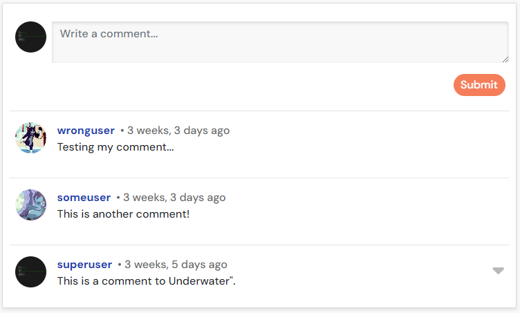

## Footer
- Located on the right panel, just below the "Latest/Users Comments" component (Home/Profile), or SignIn/Up (Components), the footer contains access to the "Contact" component, the social media links & the modal to the "Terms of Service". It is best defined by icons easily recognizable and navigable by Users.

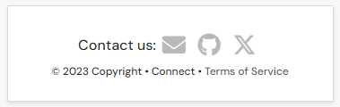

## Contact
- The "Contact" component grants users the possibility to contact the administration panel regarding any issues they are having with the platform. Users (authentication not necessary) need to input a valid e-mail*, a username, subject of concern and the message they wish to send to the Support team. Upon a successful submission, Users are notified a message has been sent.

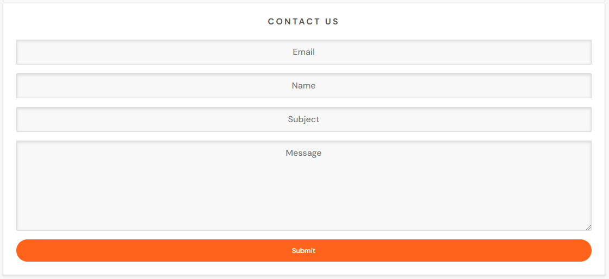

## Terms of Service
- When clicking the Terms Of Service link, located at the Footer, Users should be able to read the the "~~legal agreements~~" between Connect and a person who wants to use that service. This is defined by a modal that pops up and only goes away when the terms are met by clicking the button at the end.

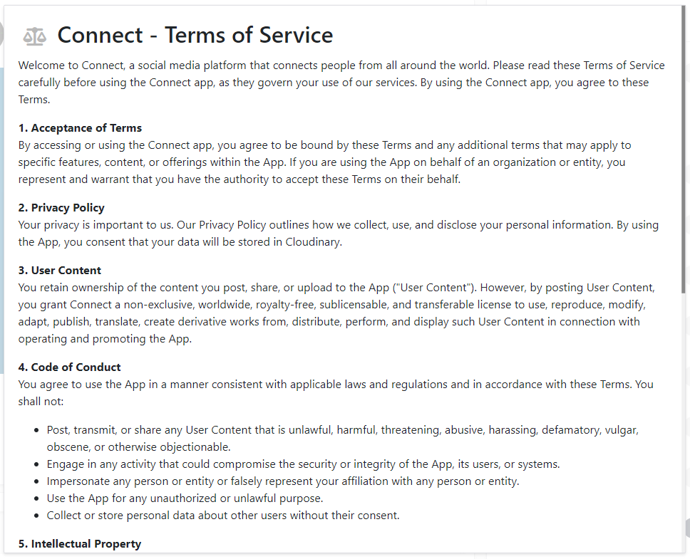

## Signin
- After creating an account, Users may log in onto their users accounts, through the Sign In component. Users will then have the possibility perform CRUD functionalities in the platform and interact with the community. To sign in Users are requested to input their log in credentials, such as Username and Password, previously created in the Sign Up page.
- The Sign in page is best defined by a a Sign in form and an image. (Ideally the image should be dynamic and change its theme according to the season (unapplied), for the time being summer)

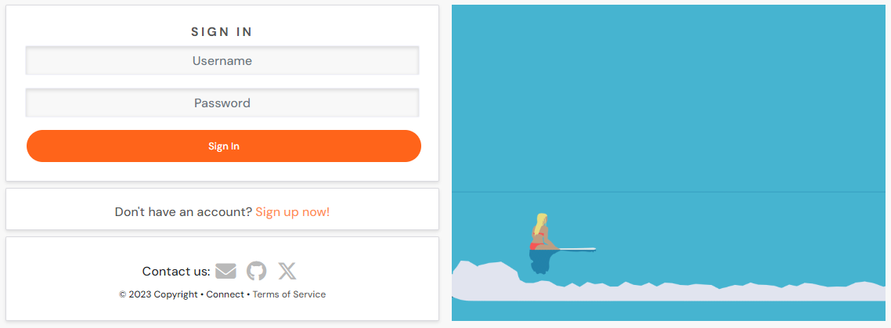

## Signup
- To be part of this community, Users must create an account. For such, users must input a Username, Password & Password confirmation and hit Sign Up. Upon a successful account creation, users can then log in via Sign In.
- The Sign up page is best defined by a a Sign Up form and an image. (Ideally the image should be dynamic and change its theme according to the season (unapplied), for the time being summer)

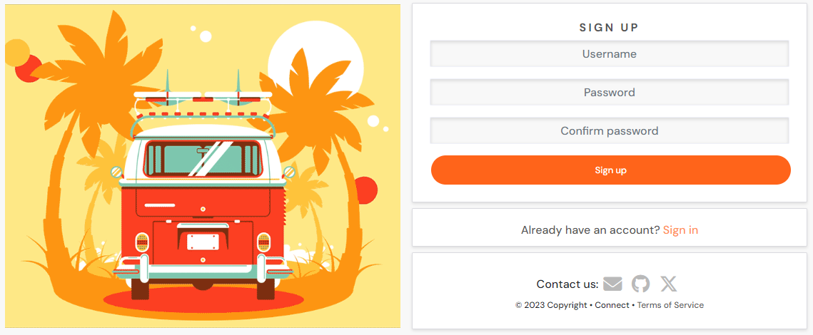

## Profile
- Once a User account is created and a user is authenticated, one can access a User "Profile".
- The User Profile details all activity performed by a given user, such a latest Posts & Comments and the number & List of Followers and Followings. Owners of a profile and visitors can then easily track the latest motions and be on pair with their followings.

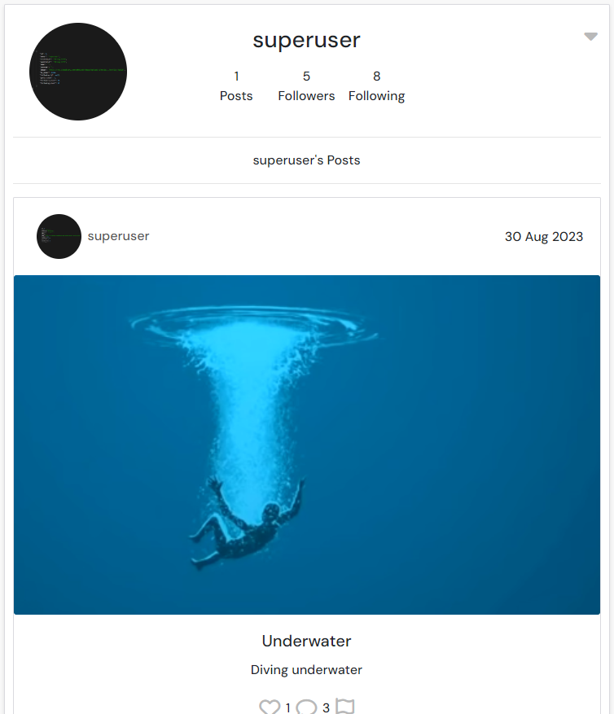

## Edit Profile, Change Username, Update Password, Delete Profile
- As the owner of a Profile (if authenticated), one may Edit the user handle, avatar, password or entirely delete the Profile. This allows the user to have total control of the User profile and CRUD at will. For such, each functionality is accessed from the dropdown menu, from within a profile owned by a user.

- Change Username

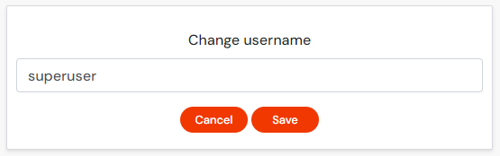

- Change Bio/Description

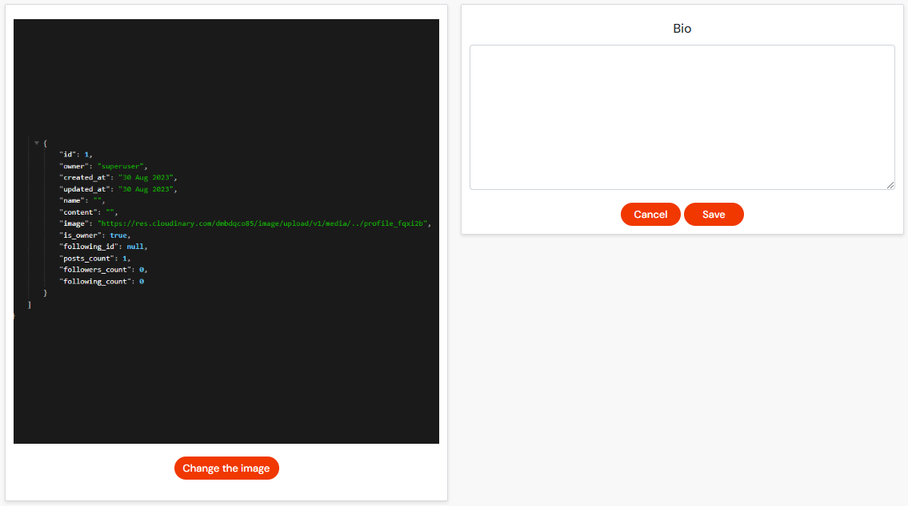

- Update Password

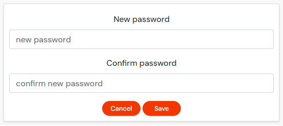

- Delete Profile

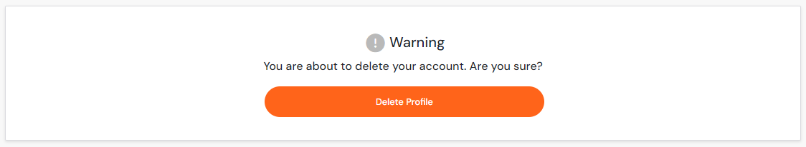

## Follow
- As a User (if authenticated), one can follow/unfollow other users. This functionality allows users to stay updated with the posts of their Followings. When following another user profile, the feed of all followings can be accessed via the "Feed" tab and will display the posts chronologically. To Follow a user one may do it through a user profile or from the PopularProfiles component. Thus, the number for each functionality will be incremented accordinglly in the Profile page.

## Popular Profiles
- The PopularProfiles component located at "/" (/home), (/feed), (/liked) displays the 10 most active Profiles. This component lets the whole community access and follow these particular users. It further promotes less popular Profiles to be more active in order to climb the ladder and be connected by other users.

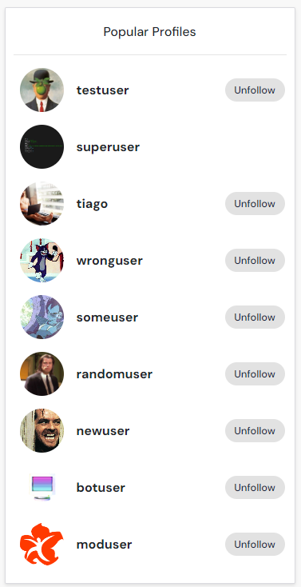

## Followers & Following
- The Followers and Followings component located only on the users Profile page displays a list, truncated by 5 users, of all the users that a user is either following or being followed by.

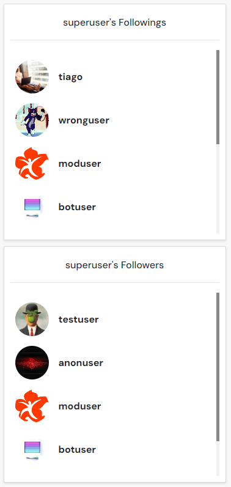

## Filtered Comments by User & Community Comments
- Respectively, the Filtered Comments & Community Comments components render in the Profile page and "/" accordingly.
- Filtered Comments lists all comments & details submited by a user to a list of posts from latest to oldest. Ergo, for each comment a link is attributted to the post of a comment, if a user wishes to read the parent Post.

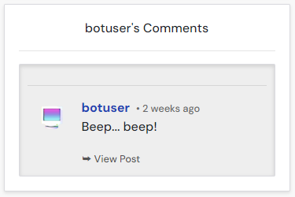

- Community Comments lists all comments & details submited by all users to a list of all posts from latest to oldest. Ergo, for each comment a link is also attributted to the post of a comment, if a user also wishes to read the parent Post.

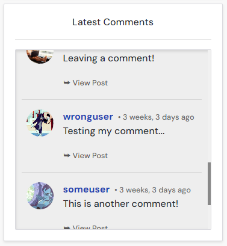

# Features & Functionality
## Features and Functionality for Reg. Non-Registered Users:
- Visitors can read all posts from "/".
- Visitors can read all users' posts from /profiles/(id)/.
- Visitors can create a user account through /signup/.
- Visitors can navigate to the "/", "/signin", "/signup", "/profiles/(id)", "/contact" pages.
- Visitors can access external links on users posts/comments and in the Footer.

## Registered Users (CRUD) can do the above as a Visitor, moreover:
- Users can sign in/out through the "/signin" & "/signout" available on the NavBar.
- Users can create posts through the "posts/create" component available on the NavBar.
- Users can update their posts through the "/posts/(id)/edit" functionality available in the MoreDropdown menu, inside the Post.
- Users can delete their posts through the "Delete" functionality provided in the MoreDropdown menu, inside the Post.
- Users can Like/Dislike all posts through the "Like/Dislike" functionality under the Post. (Users cannot use this fuctionality for their own Posts)
- Users can navigate to their own Profile.
- Users can update their own Profile Bio & Profile Picture in "Edit Profile" (/profiles/(id)/edit), from the Dropdown menu.
- Users can update their Username in "Change Username" (/profiles/(id)/edit/username), from the Dropdown menu.
- Users can update their Password in "Update Password" (/profiles/5/edit/password), from the Dropdown menu.
- Users can update delete their own Profile accounts by clicking "Delete Account", from the Dropdown menu. (Bugged)

## Planning & Agile (REVIEW BEFORE SUBMISSION)

This [project](https://github.com/users/TiagoMA90/projects/9) was planned using Agile methodology and MoSCoW prioritization.

For this purpose, the project was illustrated by [7 initial Milestone](https://github.com/TiagoMA90/connect/milestones?state=closed) entitled "Navigation & Authentication", "Profiles", "Posts", "Likes", "Comments", "Contacts" and "Reports" providing the developer with the freedom to accomplish all issues/tasks flexibly before dates deadline set to November. The Milestones were broken according to their components name.

Throughout the development process, tasks started from "Todo," progressing to "In Progress," and finally "Done". The issues were assigned to the sole developer and labeled as "could-have," "should-have,", "must-have", "wont-have" and "bugged".

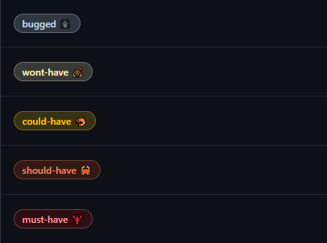

In order of priority, with 25 User Stories, the Project has:

## must-have
- Edit profile must-have
- Profile page must-have
- Create a comment must-have
- Post page must-have
- View a post must-have
- Create posts must-have
- Conditional rendering must-have
- Refreshing access tokens must-have
- Logged Status must-have
- Sign in must-have
- Authentication - Sign up must-have
- Routing must-have
- Navigation must-have


## should-have
- Footer
- Report a post 
- Feedback via Contact
- Navigate to Contact us
- Update user credentials
- View all posts by a specific user
- View comments 
- Edit post 
- Search for posts
- View latest posts
- Like a post
- Avatar

## could-have
- Pop the modal for the Terms of Service 
- Render followings profiles to a profile
- Render followed profiles to a profile
- Read filtered comments by user
- Read community comments could-have
- Follow/Unfollow a user profile 
- User profile - user stats could-have
- Most followed profiles could-have
- Edit a comment could-have
- Delete comments could-have
- Comment date could-have
- Infinite scroll could-have
- View posts of followed users could-have
- View liked posts could-have
- Delete Profile*(bugged)

## wont-have
- Delete Profile bugged*(bugged)

## Development Process
- From the begining of development, the project started out and continued from the tutorial provided by Code Institute "Moments" unit on the "Advanced Front-end specialization" module.
- It makes good use of familiar concepts such as Function Components, Props and State Hooks.

## Development & Deployment
The project was developed using GitHub and GitPod platforms...
- Navigate to: "Repositories" and create "New".
- Mark the following fields: ✓ Public ✓ Add a README file.
- Select template: "Code-Institute-Org/python-essentials-template".
- Add a Repository name: "digital-nomads".
- ...and create Repository.

... and suffered various executions using the inbuild Terminal.

For Commits on this project, the following commands ran:
- ```git add .``` <- Stages before commiting.
- ```git commit -m "written imperative declaration"``` <- Declares changes and updates.
- ```git push``` <- Push all updates to the GitHub Repository.

Through developmen the following commands ran:
- ```npm install``` <- Installs Reacts dependencies
- ```npm run start``` <- Runs the app in local environment

The database is being hosted on ElephantSQL:
- Create an account(with GitHub) and select TinyTurtle plan.
- From Details collect the URL and paste it on Heroku Config Var.

The static files are being hosted on Cloudinary:
- Create and account (with GitHub)
- From the dashboard collect the API Environment variable and paste it on Heroku Config VAR.

...and hosted on Heroku:
- After creating an Heroku Free account, and applying for Student Pack
- Navigate to: "Create new app" add a unique name "connect-network" and select "Europe" region. Click "Create App"
- Head over to "Settings" tab and apply the respective config VARs
- Move to "Deploy" section and select "Github" method"
- From here search for the repository name "connect", from the GitHub account.
- Hit "Connect" and "Enable Automatic Deploys" to keep the the repository in parallel to Heroku.
- Manually "Deploy Main Branch".
- Upon successful deployment, retrieve the link for the mock terminal.
- The live app can be found [here](https://connect-network-ee92c70de293.herokuapp.com/).

## Languages & Frameworks (Front-end)
- HTML (markup language)
- CSS (style sheet language)
- Bootsrap (CSS framework)
- React Boostrap (CSS framework on React components)
- React (javaScript Library)

## Languages & Frameworks (Back-end)
- DjangoRESTFramework (python framework)

## Other forms of development
- [Google Fonts](https://fonts.google.com/) - Source of fonts
- [FontAwesome](https://fontawesome.com/) - Source of icons
- [Bytes.dev](https://bytes.dev/) - Testing screen sizes
- Chrome DevTools - Testing tool
- [WAVE Evaluation tool](https://wave.webaim.org/) - Testing tool
- [W3validator](https://validator.w3.org/) - HTML validation tool
- [W3jigsaw](https://jigsaw.w3.org/css-validator/) - CSS validation tool
- [JSHint](https://jshint.com/) - Javascript testing tool
- [CI Python Linter](https://pep8ci.herokuapp.com/) - CI Python testing tool
- [Diagrams](https://app.diagrams.net/) - Diagram set up
- [Github](https://github.com/) - Host for the repository
- [Gitpod](https://gitpod.io/workspaces) - Code editor
- [ElephantSQL](https://www.elephantsql.com/) - Database
- [Cloudinary](https://cloudinary.com/) - Static & Media host
- [Heroku](https://id.heroku.com/login) - Cloud platform/Host the live project

## Credits
The following sources and references were resorted for the creation of this website:

- The lessons and tutorials provided by Code Institute, on the final module entitled "Moments" for the 'Advanced Front-End' specialization
- The Tutor team provided by Code Institutes Student Support
- Slack(#project-portfolio-5-advanced-frontend) as a solution platform for broken code and guidance on how to procceed to blockades
- [React](https://legacy.reactjs.org/docs/getting-started.html) documentation
- [React Bootstrap](https://react-bootstrap.netlify.app/) documetation
- Freepiks artwork on [Flaticon](https://www.flaticon.com/authors/freepik) for the logo and additional images

## Testing
- For Manual testing, please refer to [TESTING.md](LINK HERE)