# Testing:
Testing has been performed for its overall purpose.
The website has proven to exhibit dynamic functionality and responsive interactivity, both in the Front & Back-End.
After consecutive rehearsals and manual testing, the website employed the desired role and met the final goal set by the developer.

Based on the solid foundations of CRUD, testing was performed:
- By navigating and accessing links on the website.
- By Creating, Reading, Updating, and Deleting an account for a registered user. (Deleting: Bugged/Unsolved)
- By Creating, Reading, Updating, and Deleting posts of a registered user.
- By Creating, Reading, Updating and Deleting comments on a post as a registered user.
- By liking and unliking a post as a registered user.
- By following and unfollowing a post as a registered user.
- By Creating, Reading, Updating comments on the community wall as a registered user.
- By Creating, Reading, Updating reviews and ratings on a user profile as a registered user.
- By Creating a report to flag a post as a registered user.
- By Creating a message to the moderators via the contact form.
- By Populating the components (Posts, Walls, Reviews, Following Profiles/Followed Profiles) to activate infinite Scrolling.
- By inputting and retrieving results from the search box.
- By Updating the username, bio, password and image of a registered user, if authenticated.
- By manipulating posts, users, comments, likes, followers, contacts, walls, reviews as a superuser in the Admin panel.

## Functionalities
- By clicking on "Home" or the logo located in the NavBar, users are sent to the homepage, where a list of posts can be found, wit the latest being retrieved on top. From here, users can browse posts via scroll down and select one to read.
- By clicking on "Feed," users are sent to the Feed page, where logged in users can then retrieve a list of posts for all the users the authenticate duser is following.
- By clicking on "Liked," users are sent to the Liked page, where logged in users can then retrieve a list of posts for all the liked posts, initially liked by the authenticated user.
- By clicking on "Feed," users are sent to the Feed page, where logged in users can then retrieve a list of posts for all the users the authenticate duser is following.
- By clicking on "Profile," users are sent to the Profile page, where one can Read all the user activity ( including: Posts, number of Posts, number of Followers, list of Followers), number of Followings, list of Followings, all Comments created by this particuar user and Reviews & Ratings written on this user profile. If the visitor of thie profile is the owner and is authenticated, then the owner may Update (the username, bio, password and profile image) & Delete the profile (unresolved).
- Inside the Profile page, Users may Edit their Username, Profile Picture, Bio, Password and Image by clicking the three dots available at the upper right corner of the component. Users can also Delete the Profile by clicking the "Delete Profile" Button. Once the Profile is deleted the account is eliminated along with the Posts, Comments, Wall posts, Reviews, Follower & Likes associated with that particular account.
- By accessing the "Reviews" component located in the profile page of a user... authenticated users can Create a Review in a user profile. Reviews once created cannot be deleted. Rather, user can Created or Updated their own reviews on content and rating.
- By inputting words in the Seach box, Users may filter Posts according to a set of characters. Posts are automatically retrieved if a Post contains words in the Title or Body. Users may click on a post, after retrieved, in order to open and read it.
- By clicking on "Sign Up", users are sent to the Sign Up Form page. In that page, users may give in a Username and Password(2/2) in order to create an account. Once the submit "Sign Up" button is clicked, the account is created and Users may log in to their User account.
- By clicking on "Sign In", users are requested to use their credentials (Username & Password) to access their User accounts. Once "Log in" is clicked, Users are in and can start CRUDing functionalities withing the website.
- By clicking "Sign Out", users are logged out from their accounts.
- By clicking on "Post," users are redirected to the Post Form, where they must input a title & body to create a Post. Posts are submitted by clicking the Submit Button. (Users must be logged in to post.
- Once a post has been successfully created, it can be accessed and read by the entire community.
- Authors of that particular Post can Read, Update and Delete thie posts. Respectively, these functionalities are achieved by clicking the associated icons at the three dots available inside of the Post page, the "Pencil" and "Bin". Additionally Like/Unlike is restricted to non-authors of the Post, but to authenticated users only as is the creating and updating a Comment. Authenticated users can also make use of the Report function, by clicking the "Flag" next to the "Heart" and "Comment" icons.
- Flagging a Post, by Creating a Report under "Spam", "Innapropriate Content" or "Other" and optional description is resricted to Registered and authenticated users only. Reports cannot be Updated, Deleted or Read by anyone. But the Admin.
- By clicking the Like/Unlike buttons, inside of a Post, the ammount of likes should be incremented and decremneted accordingly to that post. the number should be displayed in the lower section of the post.
- By clicking the Follow/Unfollow buttons on a user profile or Popular profiles component, the ammount should be displayed in a users profile, tegether with a list of Followers and Followings. Only registered and logged in users can use this functionality.
- By clicking on the Contact logo "Letter", displayed in the footer, users are redirected to a contact form, where one is requested to input the e-mail address. One may also write the Name, Subject and Message. This component is free for all, hence, users are not requested to be autheticated. Rather anyone, including visitors may use this functionality.
- Users may write messages on the Walls compoent. Users need to be logged in in order to submit a message. Once submitted, owners of the messa may also alter or update the content of the message. Messages cannot be deleted, only Created and Updated.
- By clicking on the Terms of Service, displayed on the footer, users are faced with a modal, forcing users to read it. The modal should disapear once the button is clicked.

## Manual testing
Manual testing has been performed by exploiting test case scenarios.

| Scenario | Case | Condition | Steps | Expectation | Result | Mark |
| ------------- | ------------- | ------------- | ------------- | ------------- | ------------- | ------------- |
| Visit the Home page | Click on Home link | Reg./Non-Reg. Users | - On the navbar of the webite click on Home | Opens the Homepage in the same page | The Home page is open | Approved |
| Visit the Feed page | Click on Feed link | Registered Users | - On the navbar of the website click on Feed | Opens the Feed page in the same page | The Feed page is open and displays a list of Posts from Users a User is following | Approved
| Visit the Liked page | Click on Liked link | Registered Users | - On the navbar of the website click on Liked | Opens the Liked page in the same page | The Liked page is open and displays a list os Posts a user liked | Approved  
| Visit the Sign up page | Click on Register link | Reg./Non-Reg. Users | - On the navbar of the website click on Sign up | Opens the Sign up page in the same page | The Sign up page is open | Approved  
| Register a User account | On the Sign up page, input the requested credentials and click Sign Up | Reg./Non-Reg. Users | - Input the Username/Password1/Password2 -> Click Sign Up | Creates an User account | A User account is created | Approved  
| Visit the Sign in page | Click on Sign in link | Reg./Non-Reg. Users | - On the navbar of the website click on Sign in | Opens the Sign in page in the same page | The Sign in page is open and allows Users to log in | Approved  
| Visit the a Profile page | Click on Profile link | Registered Users | on the NavBar click on Profile | Opens a User profile page in the same page | A Profile page is open | Approved  
| Log into a User account | On the Sign in page input the Login credentials and hit Sign in | Registered Users | - Input the login credentials(Username/Password) -> Click Sign in | Logs the User | The User is logged in | Approved   
| Sign out from a User profile account | Click on Sign out link | Registered Users | On the navbar of the website click on Sign out | Logs the User out | The User is signed out | Approved  
| Upload a User Profile picture | Upload a Profile picture | Registered Users |  Click on Profile -> Click on "Edit Profile" from the 3 dots and upload a picture from your local device -> Click the Save button | Updates the User profile picture | The User profile picture is updated | Approved  
| Update the User Profile Username/Bio/Password | On the User profile, update the given Username, Bio and Password | Registered Users | Click on the User Profile -> click the 3 dots -> Choose either "Edit Profile", "Change Username", "Update Password" -> Click the save button | Updates the User details | The User profile details is updated  | Approved  
| Delete a User Profile account | From the User profile click the 3 dts and hit Delete Account | Registered Users | Access the User profile -> Click Delete Profile -> Confirm by clicking Delete | Deletes the User account | The User account is eliminated | Approved (**bugged**)  
| Use the Search Box | On the Searchbox, enter a valid keyword | Reg./Non-Reg. Users | Enter a keyword or character | Automatically retrieves a list of Posts containing a valid keyword | A list of Posts containing a valid keyword is retrieved | Approved  
| Visit a User Profile | Click the a users Username | Reg./Non-Reg. Users | - From a list of posts &/or Popular profiles -> Click on an authors Username | Accesses a User profile | The User profile is accessed | Approved  
| Create a Post | Click on "Add post"" | Registered Users | On the navbar click on "Add post" -> Input the Title* and Description* fields and upload a picture from the local device -> Click Create | Creates a Post visible at "/" / "Home" | A Post is created | Approved  
| Read/Open a Post | Click on a Post to open | Reg./Non-Reg. Users | - From Home and the list of Posts displayed on the same page, click on the Post | Opens a truncated Post | A Post is open | Approved 
| Update a Post | Click on Update | Registered Users | Inside of a Post click on the Edit icon "Pencil" from the 3 dots -> Edit the Title, Description or Image of the Post -> Click on Update | Updates a User-Post Title*, Description* or Image* | A Post is updated | Approved  
| Delete a Post | Click on Delete | Registered Users | Inside of a Post click on the Delete icon "Bin" from the 3 dots | Deletes a User-Post | Deletes a Post | The Post is Deleted | + | Approved  
| Write a Comment | Click on Add a Comment | Registered Users | - From inside of a populate the Comment form -> Write the body of a Comment -> Click on Submit | Automatically adds a Comment to a Post | A Comment is added to a Post | Approved  
| Like/Dislike a Post | Click on the Like Icon | Registered Users | From a inside of a Post click on the Like icon "Heart" (to like) &/or click again (to unlike) | Likes/Dislikes a Post | A Post is Liked/Disliked | Approved 
| Report a Post | Click on the Flag Icon | Registered Users | From a inside of a Post click on the Report icon "Flag" -> Opens a Modal to report a Post under "Spam", "Inappropriate Content" or "Other..." & Description -> Click on Report | Reports a Post | A Post is flagged and reported | Approved  
| Visit the Social Media pages | Click on a Social Media link | Reg./Non-Reg. Users | - On the footer of the website click on a Social media icon | Opens a Social Media page on another tab | A Social media page is open | Approved  
| Create a post on the Community Wall | On the Wall component, create a Wall post | Registered Users | - From the "/" or "Home" access the Community wall -> click on "Create a wall post" to collapse the Wall form -> Populate the form -> Click Submit | Creates a Wall post | A Wall post is created | Approved |
| Update a post on the Community Wall | On the Wall component, update a wall post | Registered Users | - From the "/" or "Home" access the Community wall -> click on update icon "Pencil on a window" update the initial populated submission -> rewrite the form -> Click Submit | Updates a Wall post | A Wall post is created | Approved |
| Create a Review on a profile page | On a Profile page create a Review | Registered Users | - From the inside of a Profile page -> click on "Write a Review" to collapse the Review form -> Populate the Review form & set a Rating -> Click Submit | Creates a Review to a Profile | A Review to a profile is created | Approved |
| Update a Review on a profile page | On a Profile page update a Review | Registered Users | - From the inside of a Profile page -> click on update icon "Pencil on a window" update the initial populated submission  -> Click Submit | Updates a Review to a Profile | A Review to a profile is updated | Approved |
| Contact the Administration panel | Click on the Letter Icon | Reg. Non-Reg. Users | From the Footer click on the Letter icon -> Opens a Modal with a form to fill -> Populate the form -> Click on Submit | Submits a message to the Administration panel | A message to the Administration panel is sent | Approved  

## Lighthouse & WAVE
This website, under Incognito mode, was scanned for Performance, Accessibility, Best Practices and SEO for both Desktop and Mobile devices under the Lighthouse function provided by Chrome DevTools, with favorable scores.

Both devices exhibited scores above 90% for Performance, Accessibility and SEO, with the exception for Performance (This went to the extreme on mobile devices), due to image size and extension for posts and profiles, when uploaded by Users.

Refer to the links for the templates:

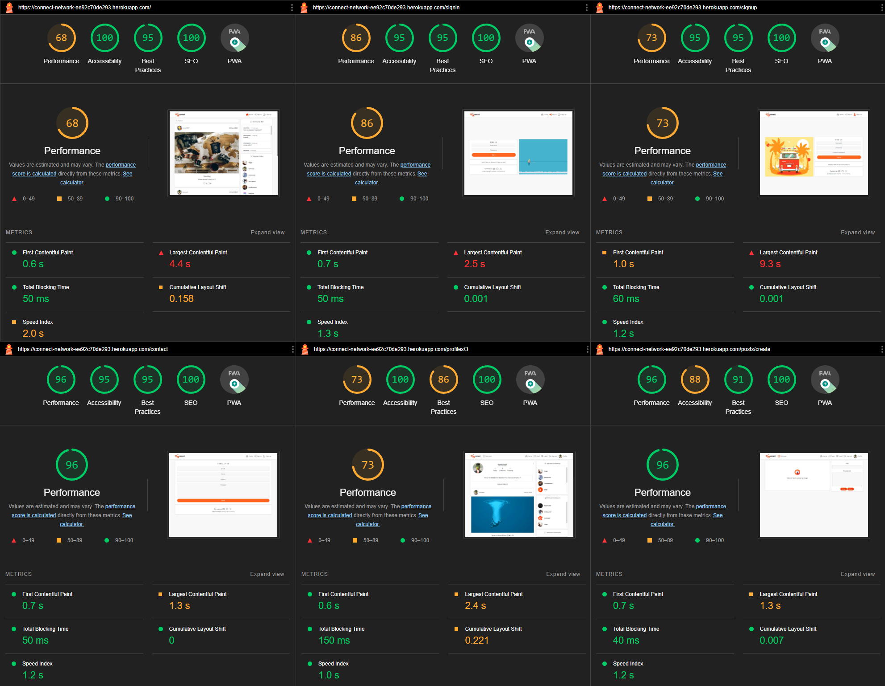
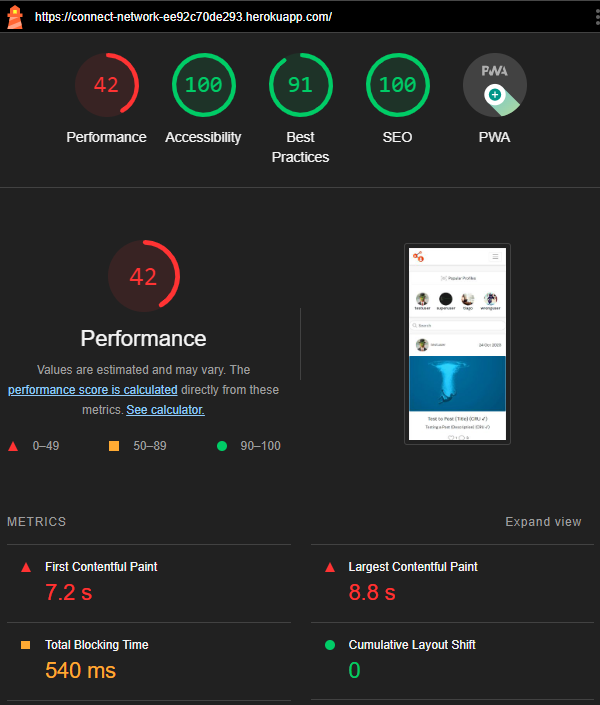

This website was scanned for Errors, Contrast Errors, Alerts, Features, Structural Elements and Aria for Desktop with Chromes extension [Wave](https://wave.webaim.org/).
In order to achieve auspicious ratings, the website underwent multiple changes on its styling in order to please both WAVE and Lighthouse.

After various examinations, tests and corrections for all its pages the website retrieved no withering Errors.
The only errors are associated with the contrast, for the buttons. WAVE Evaluation Tool recommended to change the font coloring of the buttons to be black or the background to something darker (unapplied). This is rather debatable, and ultimatly does not affect the experience for screen readers. Ergo, the developer decided to keep the original colors from the begining as intended.

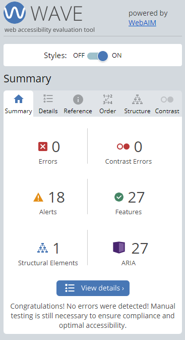

The website is responsive and displays a pleasing style to the viewers, with colors contrasting each other. Aria labels have been applied together with Structural Elements and Features.

# Validation
## ESLit
Via URL of the deployed website on Heroku, all pages were validated through ESLint & jigsaw.w3.org.
Series of errors & warnings were found and addressed accordingly, after several corrections have been applied a few remained.

When installing ESLint the following commands ran:
- ```npm install eslint --save-dev```
- ```npx eslint --init```

After a series of immediate questions prompted and wanswerd. Thus:

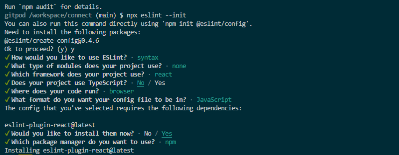

Addtionaly "Prettier - Code Formatter" and "Prettier ESLint" were installed.
When running the command ```npx eslint src```, 648 errors were retrieved, mostly associated with syntax and indentation:

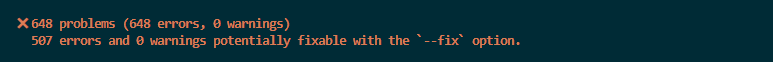

The errors were addressed by runnig the following command ```npx eslint src --fix```
The outcome, errors have been reduced to 141, associated to react/prop-types:

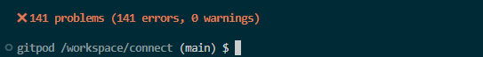

Eventually the eslintrc.js was deleted. Leaving 9 remaining warnings.

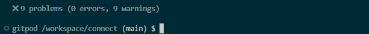

- [This tutorial](https://code.visualstudio.com/docs/nodejs/reactjs-tutorial#_linting) was used a reference, when testing with ESLint.

## CSS
- The .css styling file was tested and validated through [W3jigsaw](https://jigsaw.w3.org/css-validator/) with no issues, via direct input. [See the Report](https://jigsaw.w3.org/css-validator/validator?uri=https%3A%2F%2Fconnect-network-ee92c70de293.herokuapp.com%2F&profile=css3svg&usermedium=all&warning=1&vextwarning=&lang=en)
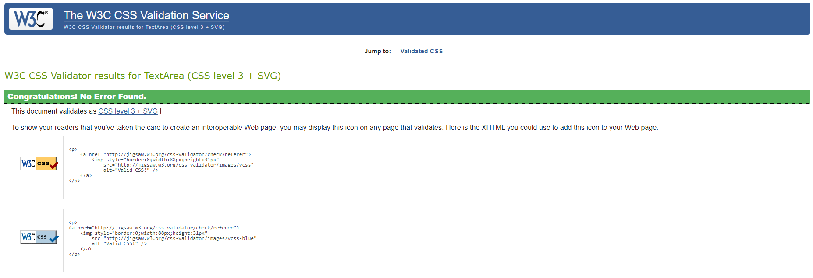

# Errors & Bugs
## Sign Up & Sign In

Through out development errors were found, confronted and solved.
Console Errors were caught on try blocks commented out and dealt accordingly.

Currently, the only errors still being logged are 401 (Unauthorized) when accessing the [Sign Up](https://connect-network-ee92c70de293.herokuapp.com/signup) and [Sign In](https://connect-network-ee92c70de293.herokuapp.com/signin) pages.


If the internet is slow is will lag and the console will log 500 errors on consecutive runs, due to elephantSQL.

- Solution: Change the useffect interval to fetch data from 1000 milliseconds to 5000 milliseconds, since loading multiple components at the same time causes this batch of consecutive errors.

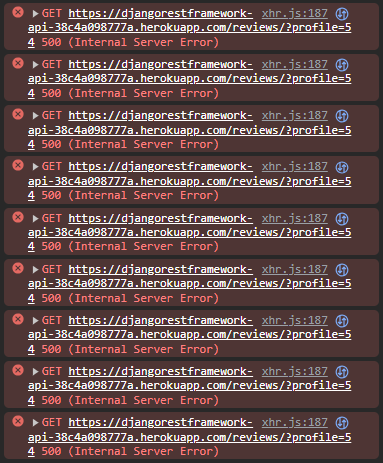

## React Simple Star Rating & React Version

Upon deploying the project to Heroku, after installing the [react-simple-star-rating](https://react-simple-star-rating.vercel.app/?path=/story/introduction--page), Heroku failed to resolve this dependecy. The component worked without problems on production, but failed to work properly when using an older ver. of React.

- Solution: Update/Reinstall React running ```npm install react react-dom``` on the console, over the old ver.

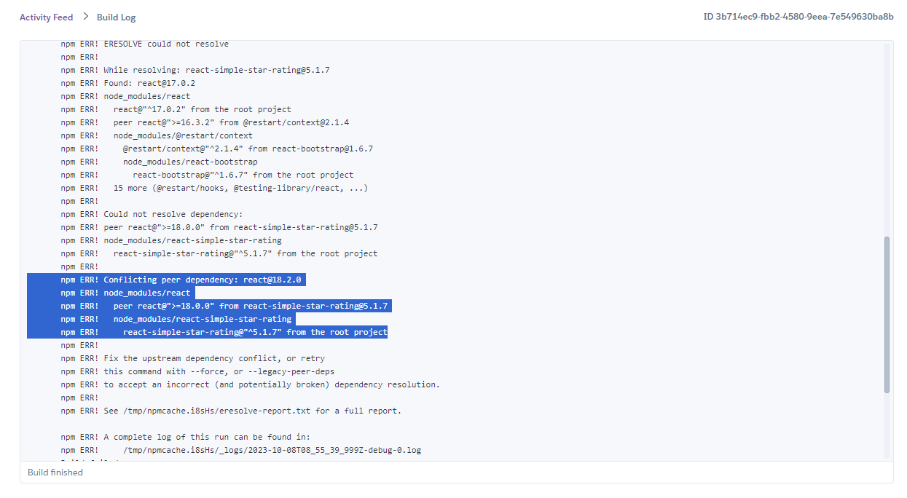

## Errors on the Review Form
Upon using WAVE Evaluation Tool when testing the app components, 2 Errors for Multiple form labels have been registered.
The Form for the reviews component on ReviewCreateForm.js throws 2 errors for the labels. Presumably 'htmlFor="CreateReviewContent"' & 'srOnly' in Form.Label, but not related, as WallPostCreateForm.js makes use of the same syntax.

- Solution: Comment out the <Form.Label> from the ReviewCreateForm.js component altogether. Outcome: It does not affect the user experience or throw any errors.

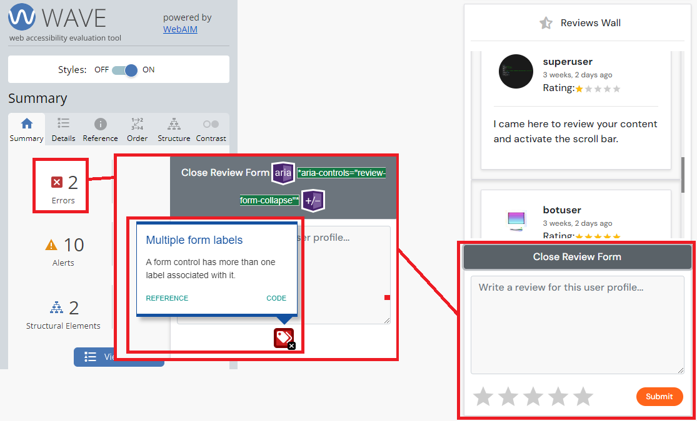

## Deleting a User Profile
Upon manual testing, if an authenticated User tries to delete a profile, it fails to properly eliminate the user profile.
After various attempts on how to correct this bug, the developer sought to delete this functionality altogether, but decided to keep it instead is and work on it when time allows.

(It is encourage no to use it, but if the assessor feels like it, see the solution below)

- Solution: Unsolved. No solution was founded yet. There is a work around that is not User friendly though. So how to proceed?

- (1) From inside of a User profile click on "Delete Account)
- (2) Access the Sote information (padlock icon, left to the URL) 
- (3) Navigate to Cookies and Website
- (4) Delete the Cookies associated with the API. In this case, [me](https://djangorestframework-api-38c4a098777a.herokuapp.com/)
- (5) Confirm
- (6) Manually Refresh the page (or Ctrl+R)

- This functionality was not deleted or commented out upon deployment, to keep it documented both for personal records of the developer and continous improvement*
- See the Image below for a visual take:

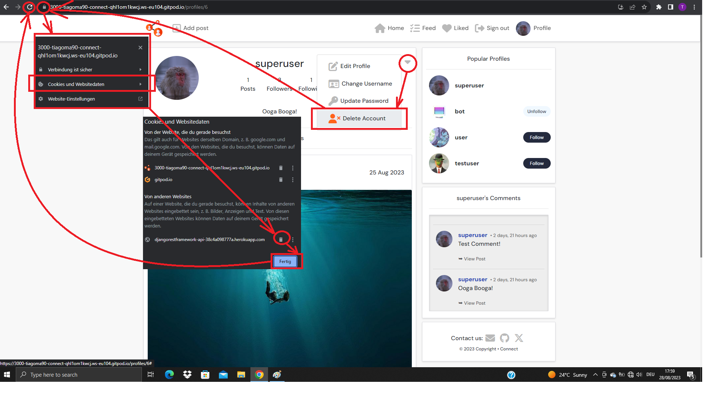

## Browser Compatibility
This website was tested on Chrome, Firefox and Microsoft Edge.
All browsers were tolerant and granted full functionality.

## Responsivness
The website was also tested through Chrome Developer tools for the following devices:

- iPhone SE
- iPhone XR
- iPhone 12Pro
- Pixel 5
- Samsung Galaxy S8+
- Samsung Galaxy S20 Ultra
- iPad Air
- iPad Mini
- Surface Pro 7
- Surface Duo
- Galaxy Fold
- Samsaung Galaxy A51/71
- Nest Hub
- Nest Hub Max